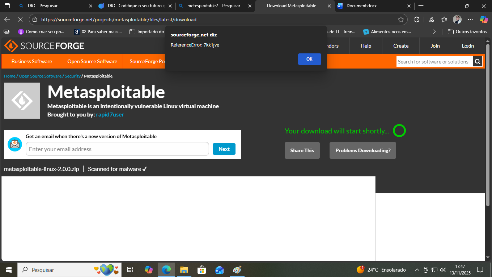

<h1 style="font-size:2.5rem; font-style:italic" align="center">Security</h1>

<h2 align="center">Este é um desafio da DIO patrocionado pela Santander.</h2>
<br>

<p>
Antes de começar abaixe o virtual box. Há dois sites que podem lhe oferecer o sistema de virtualização, o primeiro é do proprio virtualbox:<br>

```bash
https://www.virtualbox.org/wiki/Downloads</div>
```
<br>
e o segundo é o site da oralce que comprouo o virtualbox e depois é só escolher seu sistema e sua arquiteruta, baixr e instalar.<br>

```bash
https://www.oracle.com/virtualization/technologies/vm/downloads/virtualbox-downloads.html
```
</p>

<h3 align="center">Baixando Metasploitable 2</h3>

<p>Agora baixar o Metasploitable2  no seguinte site :</p> 

```bash
Metasploitable - Browse /Metasploitable2 at SourceForge.net
```
<p>
Depois clique para baixá-lo de acordo com a imagem abaixo:
</p>

 
<p>Observe os circulos vermelhos nas duas imagens. Você tem duas opções de clique, qualquer uma a baixará o metasploitable.</p>
<p>Ao clicar abrira outra janela ou o download começara imediatamente basta escolher onde você queira salvar ou download padrão </p>

<p>Caso isso aconteça clique no botão uma nova página surgirá e download lhe perguntara ou abaixará automaticamente</p>


<h3 align="center">Baixando Metasploitable 2</h3>
<p>Para baixar o kali linux vc precisa ir no :</p>

```bash
 www.kali.linux.org 
```

<p>Ao clicar no download você será redirecionado para outra página em seguida clique em virtual machines</p>

<p>Ao clicar no VirtualBox o download iniciará.</p>

<br>
<hr>
<br>

<h3 align="center">Instalando o virtual box</h3>
<br>
<p>
Vá até onde você salvou o arquivo isso é onde você fez o download executê-o, vai abrir uma janela de permissão do firewal clique sim, depois aparecera a seguinte imagem: 
</p>

<p>Espere um instante e aparecerá uma janela  de bem vindo</p>

<p>
Clica em next e aparecerera o contrato com a opção de aceitar o contrato desmarcado selecione o primeiro 
</p>

<p>Clique em next e aparecera outra tela</p>

<p>Clique em next e aparecera uma tela avisando que não pode se desconectar da inter nete ou algo do tipo</p>

<p>
Clique me next e a prescera uma tela de dependências clica em next e aparecera outra tela seleciona tudo e clica em next, depois aparecera uma tela escrita install como na imagem abaixo: 
</p>

<p>Clica install ele iniciara o processo de instalação</p>

<p>Depois aparecera a seguinte tela:</p>

<p>Clique me finish e abrirá o virtual box</p>


<hr>
<br>
<h3 align="center">Instalação do Kali linux no virtual box</h3>
<br>
<p>
Agora que foi baixado o kali linux indicado, extraia ele em uma pasta, depois abra o virtual box e clique em open a saved VirtualBox MV 
</p>

<p>Depois de clicar onde está o circulo vaia abrir uma janela, vai até onde você extraiu o kali linux</p>

<p>Seleciona esse icone em azul e clique em abir</p>
<p>E o kali linux já estará instalado </p>


<hr>
<br>

<h3 align="center">Instalando  o metasploitable 2</h3>
<br>
<p>Vá até onde vc salvou o metasploitable descompacta ele, vá no virtual box clique no icone  Novo</p>

<p>
Vai abrir uma tela em seguida digite um nome. Onde está escrito OS escolha linux, onde esta escrito OS Distribuition escolha Ubuntu 
</p>

<p>
Clique em finalizar, depois do vá no ícone de configurações representado por uma emgrangem clique nele e vamos terminar de instalar.
</p>

<p>
Com o sistema selecionado vá em configurções  clique em armazenameto vai até controladora IDE: selecione ela clique em Add Hard Disk
</p>

<p>vai abrir a seguinte janela:</p>

<p>
Clique em acrescentar e vai abrir uma janela e vai até onde vc descompactou o metasploitable selecione o ícone azul clique em abrir
</p>

<p>Depois ele voltara para tela anterior clique em escolher, e  depois clique em ok</p>
<p>O metasploitable já estará instalado. </p>
<br>
<hr>
<br>
